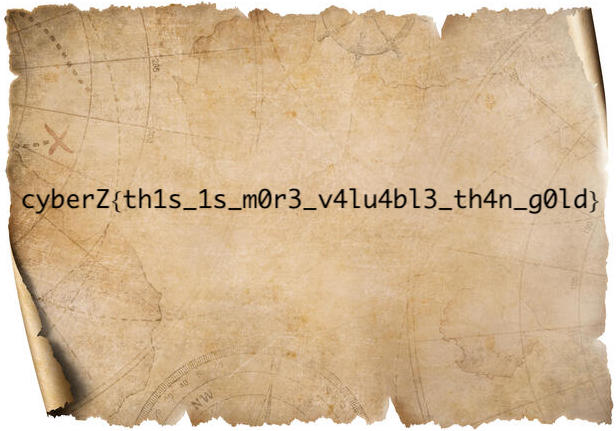

# treasure


## prompt
```md
The scroll with the flag is deep inside the chest. Walk properly to get the flag

**PS**: you might need this **dagger** later
```

<br>

## files
- treasure.jpg


<br>

## hints
No hints provided

<br>

## solution
The prompt and category suggest using binwalk on the given image.

```bash
$ binwalk --dd='.*' treasure.jpg
```

Using binwalk we obtain a password protected zip file 

```
DECIMAL       HEXADECIMAL     DESCRIPTION
--------------------------------------------------------------------------------
64376         0xFB78          Zip archive data, encrypted at least v2.0 to extract, compressed size: 47252, uncompressed size: 47621, name: scroll.jpg
111792        0x1B4B0         End of Zip archive, footer length: 22
```

rename `FB78` to `file.zip` and extract it.
The password is in the prompt `dagger`.

```bash
$ mv F8B8 file.zip
$ unzip file.zip
```

We got the flag in scroll.jpg.



<br>

## flag

```txt
cyberZ{th1s_1s_m0r3_v4lu4bl3_th4n_g0ld}
```