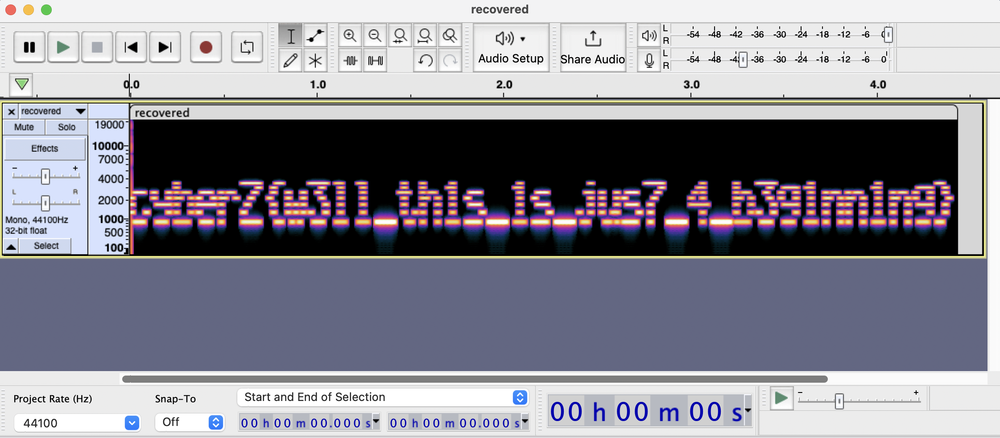

# spectrum

## prompt

```md
Recently we found out that our employee **spectrum** is leaking important data to someone outside. By the time we could catch her she burnt her hard disk. But we were able to recover some of the files. Can you figure out what this file is hiding ?

I still can't believe she has the *audacity* to do this.
```

<br>

## hints
No hints provided

<br>

## files

- [recovered.wav](./assets/recovered.wav)

<br>

## solution

The given file is a `wave` file which is just uncompressed audio data. [Learn More](https://www.movavi.com/learning-portal/wav-file.html)

Prompt hints at the words `spectrum` and `audacity` which gives the idea that the [spectrogram](https://pnsn.org/spectrograms/what-is-a-spectrogram) of this audio file has something.

Even if you doesn't realize this, you can just google it. ex: `wav file spectrum ctf`. This gives you a lot of similar challenges and you can easily get an idea.

Here `audacity` has been used, but you can use the tool of your choice. Some others include [sonic visualiser](https://www.sonicvisualiser.org/download.html), [deep sound](http://jpinsoft.net/deepsound/download.aspx).

Open the wave file on Audacity and view its spectrogram to see the flag.



<br>

## flag

```txt
cyberZ{w3ll_th1s_1s_jus7_4_b3g1nn1ng}
```