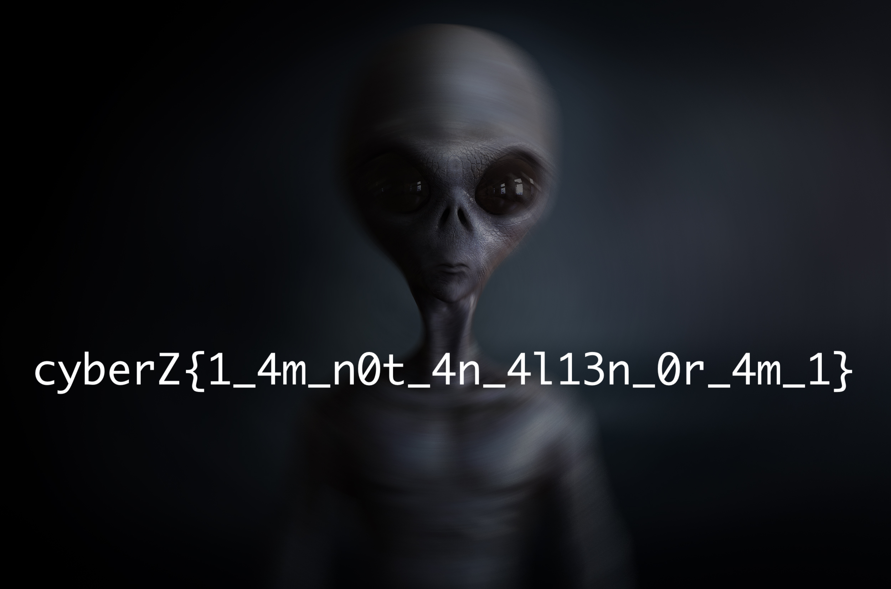

# strange

## prompt

```md
Last night when I was watching **TV**, I heard some strange noise. Luckily I was able to capture it.

My friend here is saying that it is from aliens. 

Please take a look into it.
```

<br>

## hints

```md
**scanning slowly** might help
```

## files

- [recording.wav](./assets/recording.wav)

<br>

## solution

This is again a `wave` file. The hint `scanning slowly` and the highlighted word `TV` in the prompt lead you to [SSTV](https://en.wikipedia.org/wiki/Slow-scan_television).

Now to get the flag, you can either use [qsstv](https://charlesreid1.com/wiki/Qsstv) a linux utility or [Robot36](https://play.google.com/store/apps/details?id=xdsopl.robot36) an android application to get the flag.

<br>



<br>

## flag

```txt
cyberZ{1_4m_n0t_4n_4l13n_0r_4m_1}
```