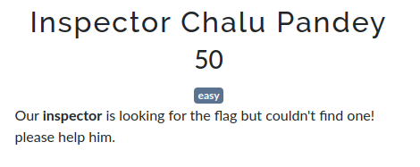

#Inspector Chalu Pandey
##prompt

##files
No files for this chall
##hints
No hints provided
##solution
As the prompt puts an emphasis on the word `inspector`, one can relate to inspecting an element.

Inspecting the prompt, we find the flag!

##flag
`cyberZ{W3ll_Y0u_f0und_7h3_fl4g_h4nd_1t_0v3r}`