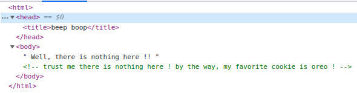

# My favourite cookie
## prompt

## files
No files for this chall
## hints
No hints provided
## solution
visting the url [http://vulnerablesite.ml:3001/](), we find there is nothing on the page. On inspecting the page we find


We head to `robots.txt` to find if there are any other urls associated and find this
```
User-agent: *
Disallow: /found-me.php
```

Now we go to [http://vulnerablesite.ml:3001/found-me.php]()

It says that it does not like `chocochip` cookie. On inspecting the under the `Application` tab in Dev tools, 


As mentioned in the prompt the value of the cookie must be `oreo`.

Setting the value to `oreo` and refreshing the page, we get the flag!


## flag
`cyberZ{wh1ch_c00ki3_do_y0u_l1k3?}`
