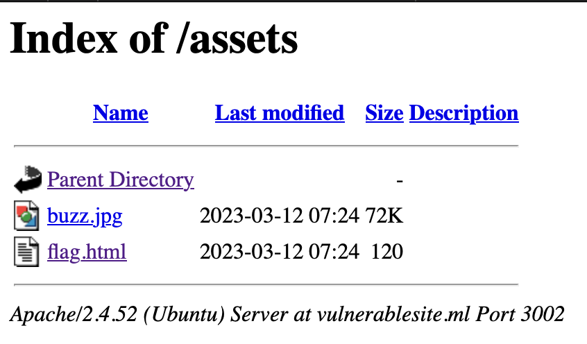

# locate

## prompt

```md
It seems my robot friend gave up on me :(
http://vulnerablesite.ml:3002/
```

<br>

## hints

No hints provided

<br>

## files

No files provided

<br>

## solution

On visiting the given link, we are greeted with this image


Now text on the image suggests that we need to find the path of the image. Checking the source, we can see that the path of the image is `./assets/buzz.jpg`.

So acccessing the directory `./assets/` reveals that there are two files `buzz.jpg` and `flag.html`



But the flag is not here. Inspecting the element reveals that there is one more directory `/real_assets/`

![real_assets]

Visiting the url `flag.html` will give the flag.

<br>

## flag
```txt
cyberZ{k33p_y0ur_a55ets_s4f3_0r_s0m3on3_w1ll_st3al_7h3m!}
```
